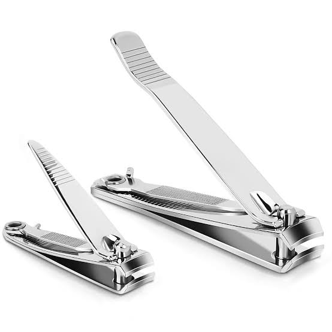
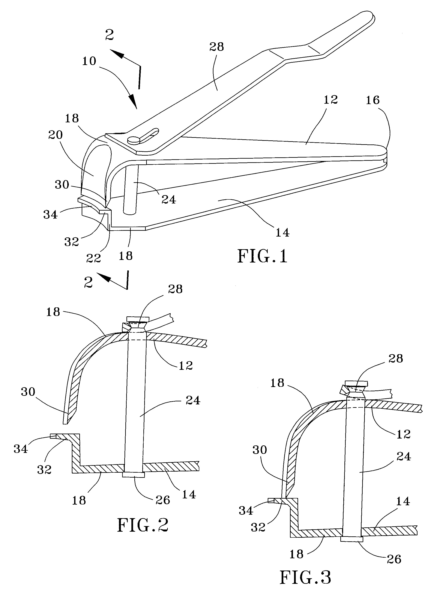
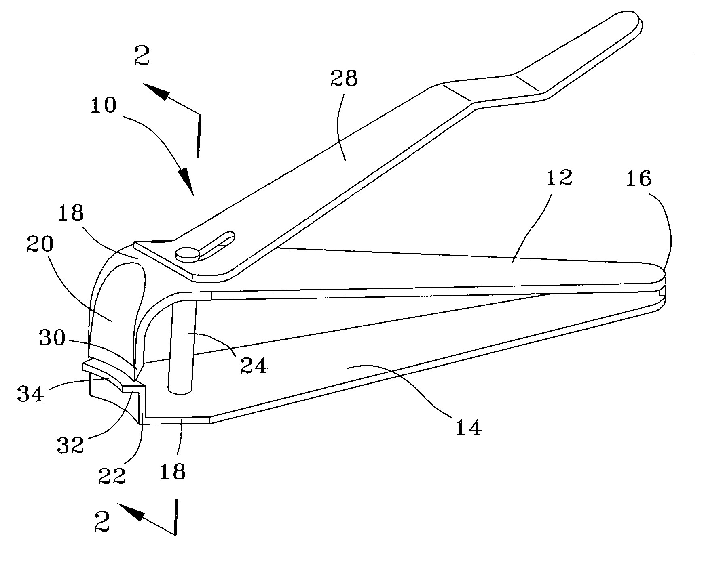

# A1

## Objective
Research Engineering portfolios and assess them for the ease of navigability, contains sufficient  information about their designs, evidence of reasoning for the designs, and use of professional language.

Cited Portfolio:
Nathan Hoong- https://nhoong.github.io/work-experience.html
Thanh Tran- https://thanhvtran.com/

## Analyze
Part A:
Nathan Hoong- https://nhoong.github.io/work-experience.html

Nathan's portfolio is organized with three main sections. This does allow the user to navigate through the portfolio with ease. From the designs featured, drawings are available and some of the designs are displayed with links to the entire report. Each of the designs has a stated objective and result summaries for a quick view, the majority of the designs to fail to explain the entirety of the process in how the design was created and the rational of why this design solves the intended goal. The writing style is mostly technical language that explains the Objective and Results.   

Thanh Tran- https://thanhvtran.com/

Thanh's portfolio has multiple access points to navigate the site within a minute. He has a menu dropdown in the top right portion of the page and hyper links at the bottom the direct you to additional pages. The projects do not include any technical drawings of projects just summaries of the skills learned and development of skills. The ability to reproduce designs from the information provided would not give enough information to reproduce or justification of reasoning. The language used in the descriptions is mostly statements of contribution to each of the projects featured on the site.

Part B:

The product that I choose is nail clippers (US20070067995A1) invented by Hector Alfaro. The primary function is to cut finger nails using leverage and a sharpened edge. 

This nail clipper has 3 primary parts which include the jaws, the lever, and the pin. This operates on a pin track to guide the jaws as pressure is applied to lever bar which features a slight bend so when pressure is applied the sharpened edge of the jaws close to the lower jaw all guided along the pin that holds all three parts in position. The bottom jaw is connected to the bottom side of the pin and the lever bar is connected at the top of the pin. The lever bar has a bend towards the end at the pin so as pressure is applied the space between the upper and lower jaws close in order to cut the intended nail. This particular design claims that it helps reduce the likelihood of cutting the nail too close or cutting a finger accidentally. This is attempted by only having the upper jaw with a sharp edge and the lower jaw flat. The upper jaw features an indentation for the tip of your finger to limit over cutting the nail. 

Other solutions for nail trimming would include nail scissors and nail files.

## Decide

Deciding between the two alternatives I would choose the nail file over the nail scissors. The nail scissors may be able to complete the function more quickly than a nail file but the intention of this nail file was to improve safety. I believe that the nail file would provide a safer experience for the user. Nail clippers are also typically intended to be used by someone on their own hands and nail scissors can be difficult to cut accurately especially when being used by someone's non-dominant hand.  

This assignment took ~4 hours to complete. 
